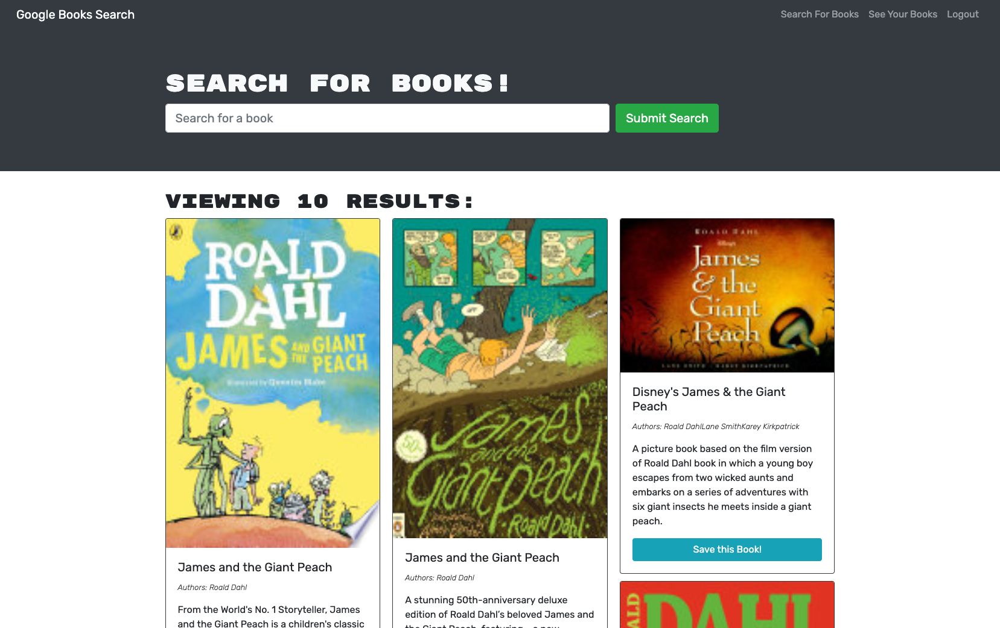
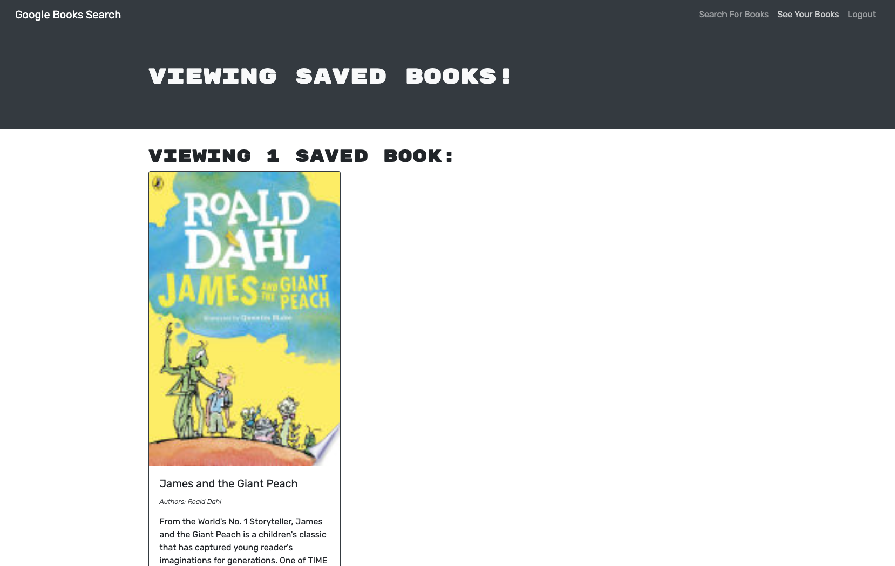

# Book Search Engine That Could

## Description 

This is a book search app built with MongoDB, Express.js, React.js, Node.js, and GraphQL - deployed to Heroku. My job was to refactor the code to function with GraphQL.
  
* [Heroku live application link](https://calm-bastion-15118.herokuapp.com/)

## Table of Contents 
* [Installation](#installation)
* [Instructions](#instructions)
* [Languages & Tools](#languages-tools)
* [Credits](#credits)
* [Contributions/Forks](#contributions/forks)
* [Questions](#questions)

## Installation

Users will need MongoDB, Express.js, Node.js, and React.js.
  
## Instructions 

Clone repository:
```
git clone <repository link>
```
Add all dependencies:
```
npm install
```
Start servers:
```
npm run develop
```

1. Sign up or log in to start searching for books. Click "Save this Book!" to add it to your saved book list:


2. Click "See Your Books" for a list of your saved books:


3. Click "Delete this Book!" to remove it from your saved book list:


## Languages & Tools

* MongoDB
* Express.js
* JavaScript
* Node.js
* React.js
* GraphQL
* Heroku

## Credits

1. Lauren Groh 
2. Help from UW Extended Campus Trilogy bootcamp tutor Ismael Lopez, askBCS team member Manan, and Trilogy starter code and materials.

## Contributions/Forks

Contributions will be accepted for this project. Please feel free to fork or clone the project for personal use. I would appreciate credit back to my [GitHub Profile](https://github.com/GrohTech). Thank you!

## Questions

If you have any questions please connect with me through [GitHub](https://github.com/GrohTech) or [legroh@uwm.edu](mailto:legroh@uwm.edu).